# TASKS
**David Zandundo Fuster 780500**

## **Task 1**
***The two services `accounts (2222)` and `web` are running and registered (two terminals, logs screenshots).***

- Accounts  (port 2222)

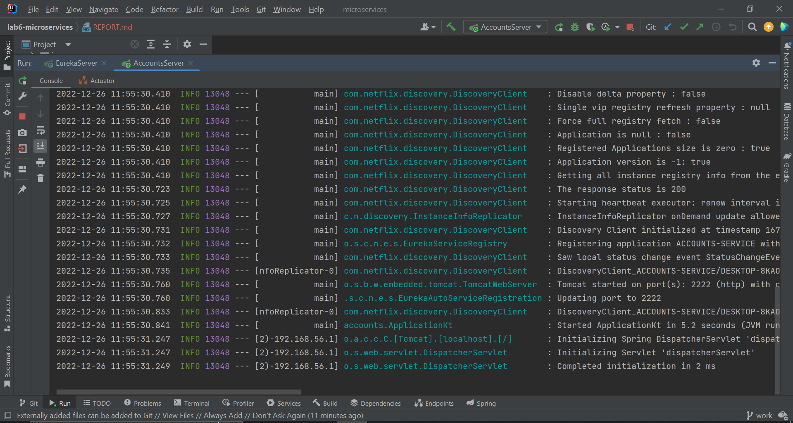

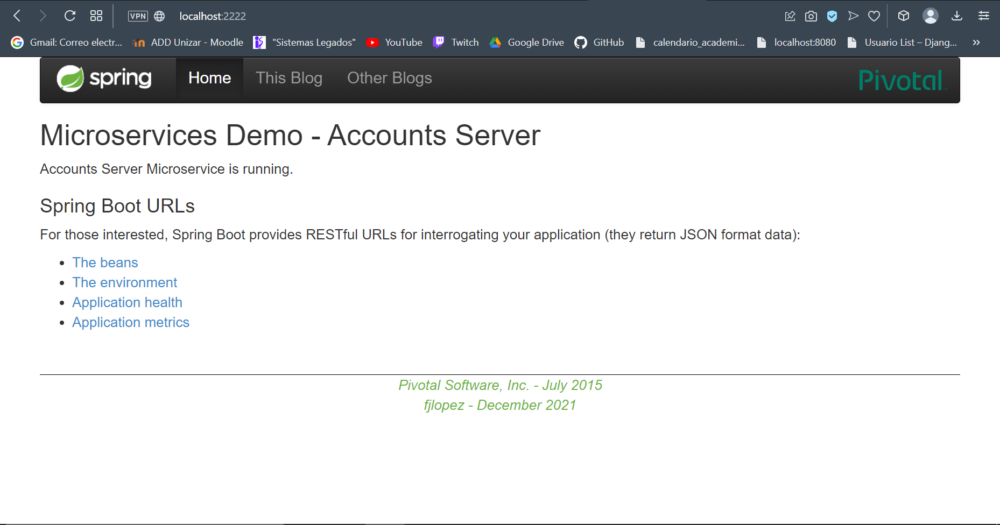

- Web  (port 3333)

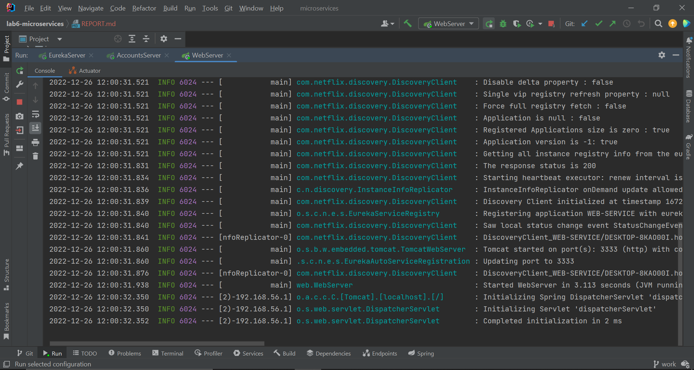

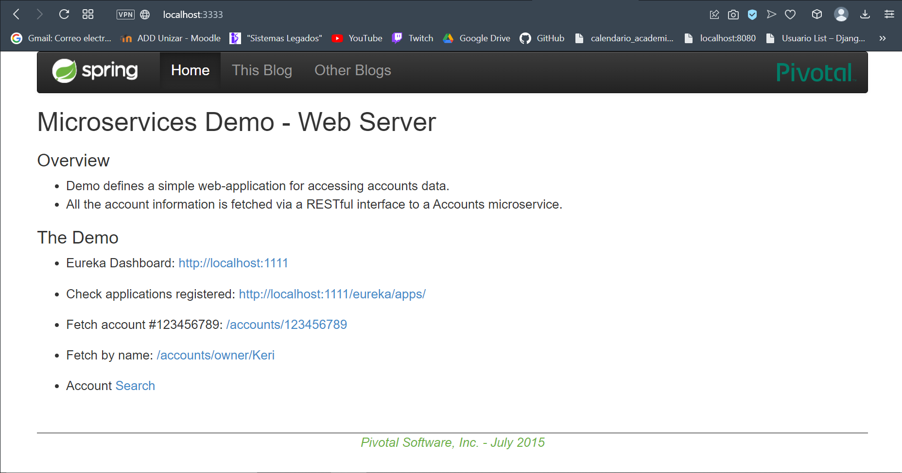

## **Task 2**
***The service registration service has these two services registered (a third terminal, dashboard screenshots).***

- Registration (port 1111)

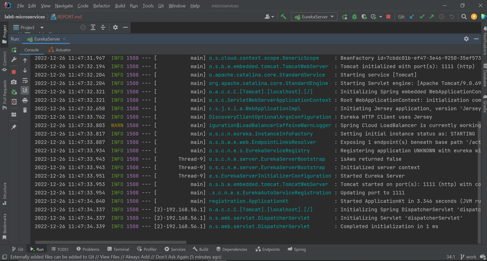

As you can see in the browser window `http://localhost:1111` the two services are registered:

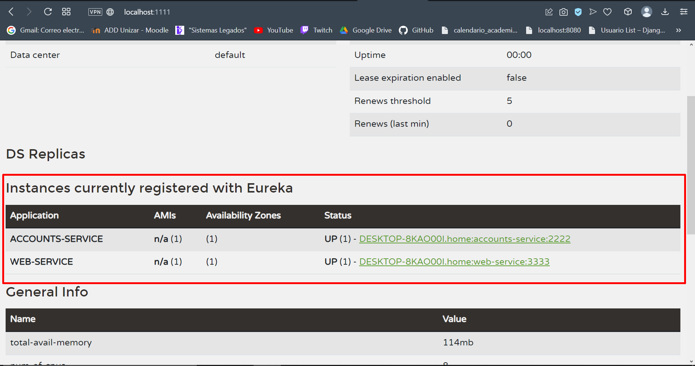

## **Task 2**
***A second `accounts` service instance is started and will use the port 4444. This second `accounts (4444)` is also registered (a fourth terminal, log screenshots).***

I have modified application.yml :
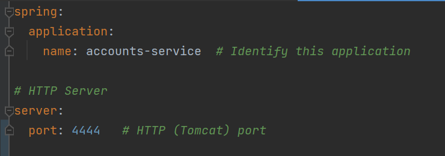

Then we can launch the new service:
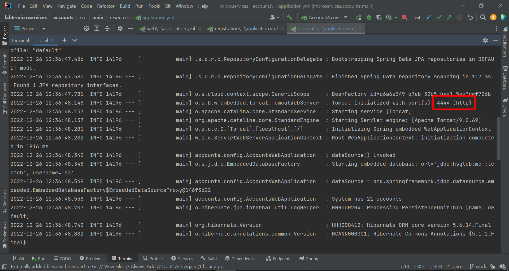

Finally, in the Registration service we should see the new service:
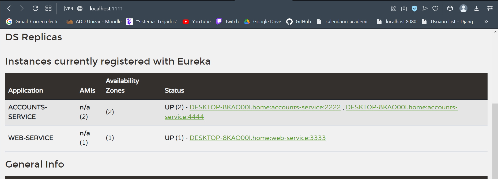

## **Task 4**
***What happens when you kill the service `accounts (2222)` and do requests to `web`? Can the web service provide information about the accounts again? Why?***

We can see if we kill the microservice with port 2222 now it doesn't appear in Eureka dashboard:
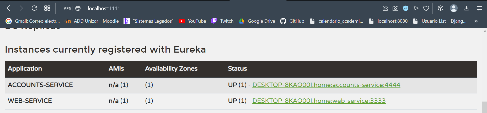

Now we do a request to `http://localhost:3333/accounts/123456789` to check if the web service can provide accounts functionality:
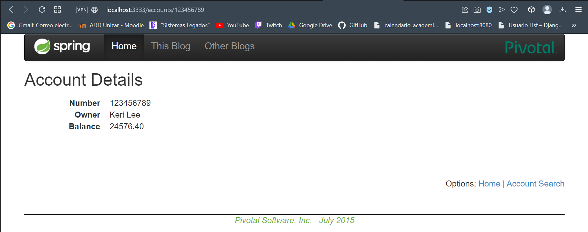

Accounts service in port 2222 was killed, but accounts service in port 4444 is alive so the web service provides information about accounts using that service. It is working because I had a replica running and registered in eureka.